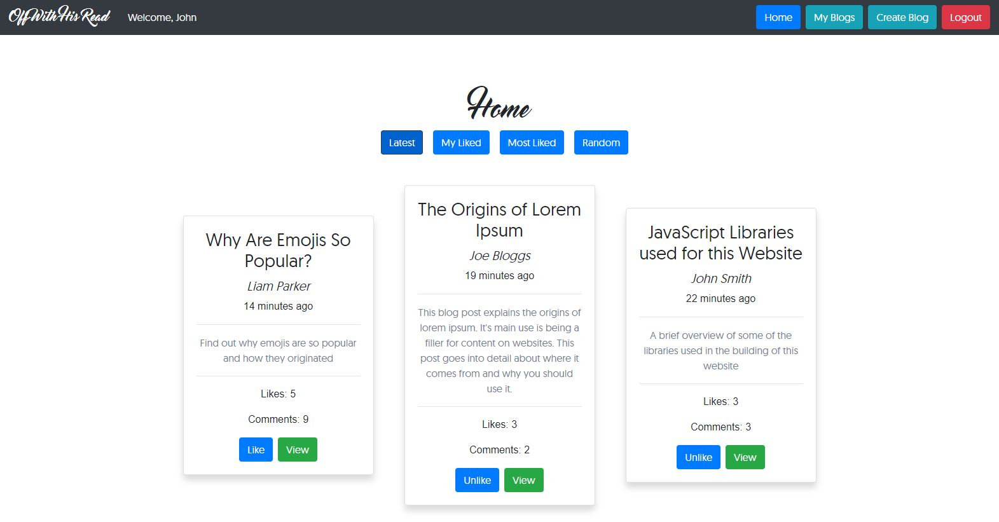

# Off With His Read

A web application for bloggers and writers to share and view content.



This application is live! You can view it [here](http://13.54.97.95:3000/).

## Prerequisites
To run this web application locally, or for development, you will need a text editor of your choice and Node.js installed.

## Getting Started
To run this web application, first download or clone this repository.  

This web application is divided into two parts, the frontend and the backend.  

To run the backend, navigate to the repository and execute the following commands:
```
cd backend
npm install
npm start
```
This will start the server at http://localhost:5000/.  

To run the frontend, navigate to the repository and execute the following commands:
```
cd frontend
npm install
npm start
```
This will start the frontend application at http://localhost:3000/.

## Running the Tests
Testing has been provided for our backend using the testing framework Mocha and the assertion library Chai.
To run the tests, navigate to the backend folder and run:
```
npm test
```
These tests have been designed to test all aspects of our backend server.

## API Endpoints
### User endpoints

* /newUser  
POST  
Creates a new user if the input fields pass validation.

* /deleteUser  
DELETE  
Deletes a user and all associated likes, comments and blogs.

* /login  
POST  
Logs in a user by creating a session.

* /logout  
GET  
Logs out a user by destroying the session.

* /checkSession  
GET  
Used when the web application is accessed to check if a user session is still active, and if so, to populate the frontend with user information.

### Blog endpoints

* /blog/:blogId  
GET  
Retrieves a blog and all associated information such as likes and comments.

* /blogs  
GET  
Retrieves 20 of the most recent blog posts.

* /blogsCustom  
POST  
Retrieves 20 blog posts in a particular sorting depending on the user's selection. The options are: recent, liked, mostLiked and random.

* /myBlogs  
GET  
Retrieves a user's blog posts.

* /createBlog  
POST  
Creates a new blog if the input fields pass validation.

* /deleteBlog  
DELETE  
Deletes the specified blog created by the user, also deletes all associated likes and comments.

* /likeBlog  
POST  
Likes a blog if the user is logged in. If blog is already liked, blog is unliked.

* /commentBlog  
POST  
Comments a blog if the user is logged in.

## Key Principles of Code Style and Design
The following coding conventions have been used to provide consistency and improve readability of code.

1.	Variable names and function names use lower camel case.
2.	Constants should be written entirely in uppercase.
3.	File names and class names use upper camel case.
4.	Directory names use lower case with words separated by a hyphen.
5.	HTML class names use lower case with words separated by a hyphen.
6.	The names of the above items should provide intrinsic documentation – they should be concise and descriptive.
7.	Comments should be meaningful and placed where helpful. If it isn’t immediately obvious what a function or section of code does, a comment should be provided.
8.	Comments are placed on a separate line above the code they are referring to.
9.	Comments start one space after the comment delimiter and start with a capital letter. They do not need a period at the end of the sentence unless there are multiple sentences. For example:
    - // Comment
    - // One sentence. Another sentence.
10. Components have a description of their purpose above the class definition. They use the following format:
```
/*  
    This component has purpose...
    This component does...
*/
```
11.	Break down large items into smaller ones – this goes for modularising components and splitting large functions into smaller ones.
12.	Code indentation is made up of four spaces.
13.	Use a semicolon after every statement in JavaScript.
14.	JSX statements use double quotes for attributes and all other JavaScript use single quotes.
15.	Self-closing tags use a single space. For example:
    - \<Component />
16.	Keep code as simple as possible. For example, use the conditional (ternary) operator instead of an if statement if the whole statement can be expressed on one line, and do not compare x == true.
17.	Each component in React should have its own css file if needed in the styles folder for its own HTML classes.
18.	A single blank line should be used to separate code segments.

## Authors
* [Jason Gilmore](https://github.com/jasongilmore)
* [Kevin Tang](https://github.com/KevinKTang)
* [Julian Petkov](https://github.com/JulianPetkov)
